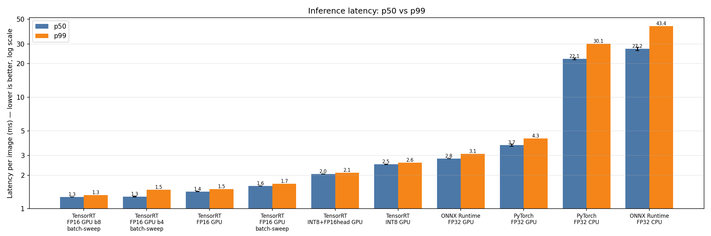
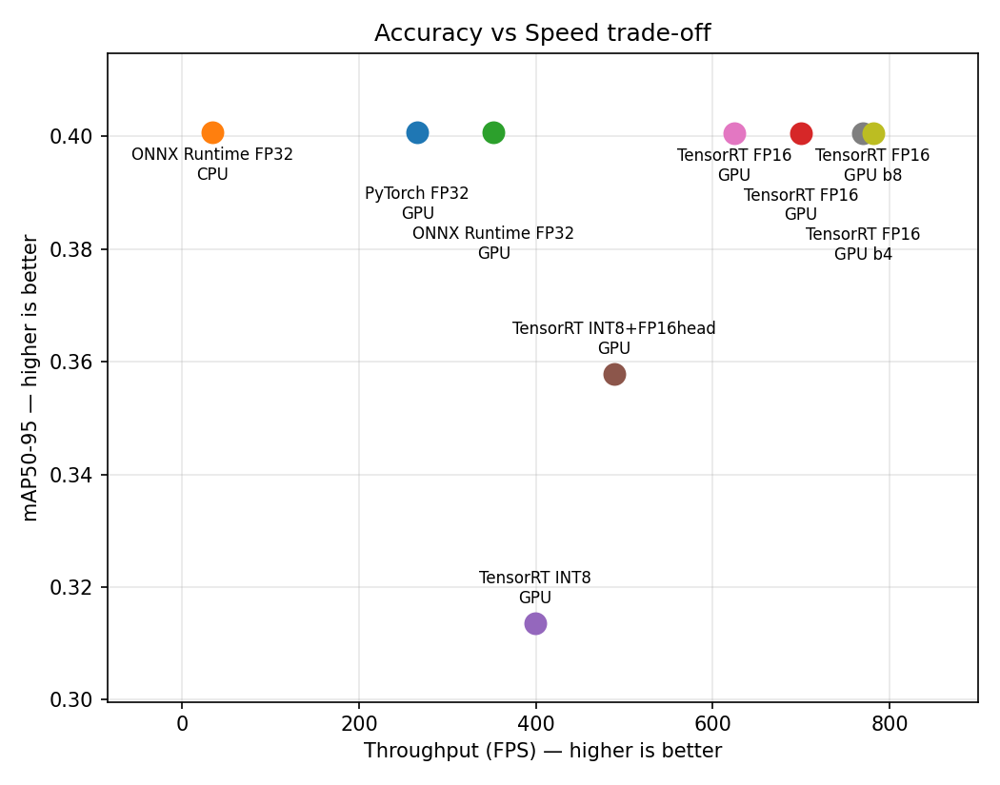

# YOLO Inference Optimization Benchmark

Benchmarking YOLOv8n across PyTorch / ONNX Runtime /
TensorRT FP16 / TensorRT INT8 on RTX 5060 (Blackwell, sm_120).
TensorRT FP16 reaches 699 FPS, 2.63x PyTorch on the same GPU, at the same accuracy.

**Status:** Complete for batch 1. All seven configurations measured in one run —
PyTorch, ONNX Runtime and TensorRT across CPU and GPU, each checked against the PyTorch
baseline before being timed. TensorRT FP16 wins at 2.63x PyTorch GPU for 0.0002 mAP.
INT8 was also measured across batch 1/8/16 and is slower than FP16 as well as less
accurate at every one; see [INT8: what it costs](#int8-what-it-costs). Batching is
swept at 1/4/8 and buys 25% throughput for roughly 6x the per-frame latency, which this
workload does not need.

## Results (YOLOv8n, 640x640)

| Runtime | Precision | Device | p50 (ms) | p99 (ms) | FPS | E2E (ms) | mAP50-95 | Size (MB) | VRAM (MB) | vs PyTorch GPU |
|---|---|---|---|---|---|---|---|---|---|---|
| TensorRT | FP16 | RTX 5060 | **1.43** | 1.49 | **699.4** | 3.62 | 0.4006 | 7.9 | 189 | **2.63x** |
| TensorRT | INT8+FP16head | RTX 5060 | 2.04 | 2.10 | 488.7 | 5.39 | 0.3579 | 51.3 | 250 | 1.84x |
| TensorRT | INT8 | RTX 5060 | 2.50 | 2.58 | 399.1 | 5.76 | 0.3136 | 52.7 | 281 | 1.50x |
| ONNX Runtime | FP32 | RTX 5060 | 2.81 | 3.10 | 352.2 | 5.97 | 0.4008 | 12.3 | 212 | 1.32x |
| PyTorch | FP32 | RTX 5060 | 3.72 | 4.26 | 266.1 | 6.22 | 0.4008 | 6.2 | 208 | 1.00x |
| PyTorch | FP32 | Ryzen 5 7500F | 22.11 | 30.11 | 43.8 | 24.89 | — | 6.2 | — | 0.16x |
| ONNX Runtime | FP32 | Ryzen 5 7500F | 27.16 | 43.43 | 34.6 | 32.14 | 0.4008 | 12.3 | — | 0.13x |

A full-val2017 accuracy reference, not a latency measurement: PyTorch FP32 on all 5000
images scores 0.3651. See [what the mAP numbers mean](#what-the-map-numbers-do-and-do-not-mean).

**TensorRT FP16 is the configuration to use.** It is 2.63x PyTorch on the same GPU, uses
the least VRAM of any GPU row, and gives up 0.0002 mAP. Both INT8 variants are slower
than FP16 *and* less accurate — [why that happens](#int8-what-it-costs) is its own
section. The GPU is 5.9x the PyTorch CPU baseline, and ONNX Runtime on CPU is slower
than PyTorch on CPU, which is the one result here that runs against the usual
expectation that an exported graph beats an eager one.

The trade-off plot is the argument in one picture: TensorRT FP16 sits top-right, fastest
*and* at baseline accuracy, so nothing here trades accuracy for speed usefully. Both
INT8 points sit down and to the left of it — giving up mAP and getting less throughput
for it.

Latency is one full inference cycle — host-to-device, execute, device-to-host, then
synchronise — mean of 3 runs of 300 iterations (CPU: 100) after 50 warm-up iterations,
over the 500-image set. That is the per-frame cost a real caller pays, and it is
deliberately not the same measurement `trtexec --noDataTransfers` reports in the INT8
section below; the two differ by more than transfer time, for a reason worth knowing:

| engine | auxiliary streams | trtexec, pipelined | this table, serialised | difference |
|---|---|---|---|---|
| FP16 | 2 | 0.542 ms | 1.43 ms | 0.89 ms |
| INT8+FP16head | 2 | 1.148 ms | 2.04 ms | 0.89 ms |
| INT8 | **5** | 1.115 ms | 2.50 ms | **1.39 ms** |

trtexec measures steady-state throughput, where an engine's auxiliary streams overlap
across consecutive inferences. A per-frame pipeline cannot use that overlap and pays to
synchronise those streams on every call. Both engines with 2 auxiliary streams pay the
same 0.89 ms; the one with 5 pays half a millisecond more. It reverses the ranking of
the two INT8 engines — pipelined, plain INT8 looks slightly faster than the head-pinned
one; per frame, it is half a millisecond slower. Pinning the detect head back to FP16
drops the engine from 5 auxiliary streams to 2, so it buys latency as well as accuracy.
Neither measurement changes the headline: FP16 wins under both.

### Does batching help?

Batch 1 answers "how fast is one frame". It cannot answer "will this card keep up with
four 30 FPS cameras", which needs throughput at batch — and the per-frame cost of
getting it. FP16 only, since INT8 already loses to it at every batch size.

| batch | ms per image | img/s | GPU time for the batch |
|---|---|---|---|
| 1 | 1.60 | 624.5 | 1.6 ms |
| 4 | 1.28 | 770.1 | **5.1 ms** |
| 8 | 1.28 | 781.1 | **10.2 ms** |

**The per-image column is the throughput view and it flatters batching.** Batch 8 looks
20% cheaper per image, but a frame does not get its result after 1.28 ms — the batch
takes 1.28 x 8 = 10.2 ms of GPU time, and no frame in it is done until that finishes,
before counting however long the batch took to fill. So batch 8 buys 25% more
throughput for roughly 6x the per-frame latency, and almost all of that throughput
arrives by batch 4; the step from 4 to 8 is worth 1.4%.

For a per-frame deadline, batch 1 is the right answer on this card. Note also that the
batch-1 row here is 1.60 ms against the static engine's 1.43 ms — the sweep uses a
dynamic-shape engine, and that flexibility costs 12% even when you feed it one image.

To the original question: four cameras at 30 FPS is 120 FPS, and static FP16 at batch 1
delivers 699. Nearly 6x headroom without batching at all, so the interesting constraint
on this card is not throughput.

mAP is measured at conf 0.001 / IoU 0.7 as COCO AP requires; the latency rows use
deploy thresholds (0.25 / 0.45) — see `common.py` for why these differ on
purpose. Every row was measured in one `./run_all.sh` run with the CPU governor on
`performance`, recorded per row in `results.jsonl`.

## Export parity

Every export is checked against the PyTorch model it came from before any speed is
measured, because an export that quietly changed the model still produces perfectly
plausible latency numbers. `check_parity.py` runs the same images through each runtime
and compares detections, and `run_all.sh` stops the run if they disagree.

| Runtime | Precision | mAP50-95 | mAP50 | vs baseline |
|---|---|---|---|---|
| PyTorch (baseline) | FP32 | 0.4008 | 0.5476 | — |
| ONNX Runtime GPU | FP32 | 0.4008 | 0.5475 | 0.0000 |
| ONNX Runtime CPU | FP32 | 0.4008 | 0.5476 | 0.0000 |
| TensorRT | FP16 | 0.4006 | 0.5481 | -0.0002 |

Same 500 images, same `common.py` pre/postprocess, conf 0.001 / IoU 0.7 as COCO AP
requires.

**The gate is not a pixel tolerance.** Two things rule that out:

- *A pixel delta means different things at different box sizes.* 5 px on a 600 px box
  is nothing; 5 px on a 30 px box is a different detection. Measured over 497 matched
  pairs against the FP16 engine, mean absolute delta is 0.17 px for boxes under 100 px
  and 0.46 px for boxes over 500 px, while mean *relative* delta runs the other way —
  0.38% against 0.08%. A per-box rule in pixels and one in percent fail at opposite
  ends.
- *NMS keeps one box out of several.* Where an object has near-duplicate candidates the
  scores deciding which survives can differ in the fourth decimal, so the two runtimes
  keep different, equally valid boxes. On `000000394206.jpg` PyTorch keeps one scoring
  0.46719 and TensorRT one scoring 0.46680, 47 px apart on a 230 px box. Comparing kept
  box against kept box is ill-posed here at any threshold.

So the check asks whether both runtimes found the same objects. Every detection has to
pair with one of the same class at IoU >= 0.90 *or* land within 2 px of it, scores must
agree within 0.02, and mean box drift must stay under 0.5% of box size — that last one
catches a systematic shift that per-box IoU would let through. The 2 px alternative is
there because IoU is hypersensitive on small boxes: 1.14 px of disagreement on a 28 px
box is already IoU 0.9093, and that is the worst pair ONNX FP32 produces against
PyTorch FP32, two runtimes that are numerically all but identical. Two kinds of disagreement are allowed, and printed
rather than hidden:

- A detection within 0.05 of the confidence threshold may appear on one side only. At
  conf 0.25 a box scoring 0.2510 against 0.2498 is the threshold being stepped over,
  not a detection being lost. 10 of these across the 500 images.
- A pair below 0.90 IoU is re-checked against the boxes each runtime produced *before*
  NMS ran. If both sides produced both boxes, only the tie-break differed. 4 of these,
  between 0.79 and 0.88 IoU, each matching the other side's candidates at 0.988 or
  better.

Both gates were checked by perturbing a working engine rather than taken on trust.
Shifting every box 1 px sideways and widening every box by 2% are both caught, at
1.338% and 0.864% mean drift, and in both cases no individual pair trips the per-box
gate at all — without the mean, both would pass. Larger errors trip everything: a 10 px
shift fails on drift, on 298 pairs, and on 153 detections that stop matching entirely.

**INT8 is reported here but not gated,** and that is a measured conclusion rather than
an exemption. Running the same perturbation test against a clean INT8 engine:

| perturbation | mean drift | pairs failing per-box | unmatched |
|---|---|---|---|
| none | 6.046% | 854 | 689 |
| x shifted 1 px | 6.216% | 932 | 689 |
| x shifted 3 px | 7.189% | 1258 | 709 |
| width x1.02 | **5.931%** | 809 | 689 |
| width x1.10 | 6.536% | 1102 | 693 |

Where FP16 moves 5.6x on a 1 px shift, INT8 moves 1.03x — and a 2% widening lands
*below* the clean engine, because the quantization noise is larger than the error and
partly cancels it. The unmatched column is identical to the detection across three rows.
No threshold separates a good INT8 engine from a bent one, so any number chosen here
would either fail working engines or pass broken ones. These engines report `UNGATED`
with their drift printed, a mismatched output shape still fails, and mAP — where a 3 px
shift is obvious — is what actually judges them.

## INT8: what it costs

On this GPU, **INT8 is slower than FP16 as well as less accurate, at every batch size
measured**, so it is dominated outright. Timings here are `trtexec --noDataTransfers`,
an independent tool measuring steady-state throughput, chosen so this conclusion does
not rest on the same harness that produced the results table; throughput is per image,
so batched rows are comparable to batch 1. They are pipelined numbers and so run faster
than the per-frame figures in the [results table](#results-yolov8n-640x640) —
the two are reconciled there, and FP16 wins under both.

| Engine | batch | median | img/s | vs FP16 | mAP50-95 |
|---|---|---|---|---|---|
| FP16, static shape | 1 | 0.540 ms | 1841 | — | 0.4006 |
| INT8, static shape | 1 | 1.110 ms | 894 | **0.49x** | 0.3136 |
| FP16, dynamic shape | 1 | 0.778 ms | 1277 | — | 0.4004 |
| INT8, dynamic shape | 1 | 0.970 ms | 1025 | **0.80x** | 0.3135 |
| FP16, dynamic shape | 8 | 3.152 ms | 2468 | — | — |
| INT8, dynamic shape | 8 | 4.675 ms | 1692 | **0.69x** | — |
| FP16, dynamic shape | 16 | 7.132 ms | 2226 | — | — |
| INT8, dynamic shape | 16 | 10.445 ms | 1525 | **0.69x** | — |

Batching was the test that could have rescued INT8: yolov8n at batch 1 is small enough
to be bound by kernel launches and memory rather than compute, which is the regime where
INT8 has nothing to win with. It does not rescue it — INT8's best showing anywhere is
0.80x of FP16. There is no reason here to pick a config that is slower *and* 22% less
accurate.

Batching does help FP16, from 1841 to 2468 img/s, and batch 16 is worse than batch 8
(2226), so the useful operating point on this card is around batch 8.

### Why INT8 is slower

Rebuilt with `--detailed-layers` (`ProfilingVerbosity.DETAILED`, off by default because
it inflates the engine) so `trtexec --dumpProfile` reports real layer names instead of
`__mye48100_myl0_0`. Grouping each layer by the work it does — names like
`__myl_SiluCastMulMinMaxRounCast` are a quantize step fused whole: scale, clamp, round,
cast:

| | static INT8 | dynamic INT8 | static FP16 |
|---|---|---|---|
| convolution | 539 us | 639 us | **517 us** |
| quantize / dequantize | **721 us** | 452 us | **none** |
| reshape / move / concat | 393 us | 168 us | 86 us |
| other (mostly SiLU) | 58 us | 38 us | 279 us |

The first row is the whole story: **INT8's convolutions are not faster than FP16's** —
539 us against 517 us, 4% slower, and convolution is the only thing INT8 exists to
speed up. With nothing gained there, what remains is cost: 721 us of quantize work that
FP16 does not do at all, plus 307 us more data movement.

That is consistent with the shape of this model rather than with anything going wrong.
yolov8n at 640x640 batch 1 runs convolutions of 16–256 channels, which are bound by
memory rather than arithmetic, so halving the width of the arithmetic buys nothing while
still requiring a conversion around every layer.

Treat these numbers as a breakdown of *where the work is*, not as a latency budget:
profiling adds its own overhead (static INT8 reports 1.716 ms here against 1.110 ms in a
clean run), and with auxiliary streams in play the per-layer sum is not a serial
timeline.

**Why the static INT8 engine is 10x the size and slower.** Not the number of compiled
kernels — 126 against the dynamic build's 100 — but their size, averaging 0.44 MB
against 0.058 MB. With static shapes Myelin fuses far more aggressively and then fans
the result across **6 CUDA streams with 47 wait/signal nodes**, where the dynamic build
runs on one stream with none. On a model whose whole forward pass is about a
millisecond, that synchronisation costs more than the parallelism returns, which is why
a static shape wins for FP16 and loses for INT8.

**Static or dynamic shape.** For FP16 at a fixed batch, build static: 0.540 ms against
0.778 ms, 44% faster, because dynamic shapes block the constant folding that takes the
graph from 321 nodes to 233. For INT8 it is the other way round, for the streams-and-
synchronisation reason just above.

### Where the accuracy goes

Recorded before the latency above was measured, and kept because it is the answer to a
separate question — *if* INT8 were worth using, which layers cost the accuracy. All rows
are the same 500 val2017 images against the 0.4008 FP32 baseline.

Two things were ruled out first. **Calibrator preprocessing**: `ImageCalibrator` calls
the same `common.preprocess` used at inference, so the dynamic ranges are measured on
the data the model actually sees. **Calibration set size**: 500 images gives 0.2898,
1000 gives 0.3136, 2000 gives 0.3122 — saturated at 1000, which is what `run_all.sh`
uses.

Then a per-block sweep, pinning one `/model.N/` block back to FP16 and leaving the rest
in INT8, so each delta is that block's share of the 0.0872 gap:

| pinned block | mAP50-95 | delta | share of gap |
|---|---|---|---|
| `/model.22/` (detect head) | 0.3580 | +0.0444 | 50.9% |
| `/model.4/` (C2f, stride 8) | 0.3252 | +0.0116 | 13.3% |
| `/model.2/` | 0.3162 | +0.0026 | 3.0% |
| 10 other blocks | 0.3107–0.3152 | -0.0029 to +0.0016 | dust |
| `/model.21/` | 0.3080 | -0.0056 | -6.4% |

Two blocks hold 64% of it. The negative entries are not noise — rebuilding the same
pinning twice moves mAP by 0.0001, while `/model.21/` costs 0.0056 — so taking a block
out of INT8 can make things worse by shifting where TensorRT fuses and quantizes around
it. Stacking the blocks that help is close to additive:

| config | mAP50-95 | vs FP32 |
|---|---|---|
| INT8 | 0.3136 | -21.8% |
| + `/model.22/` | 0.3579 | -10.7% |
| + `/model.4/` | 0.3723 | -7.1% |
| + `/model.2/` | 0.3758 | -6.2% |
| + `/model.1/`, `/model.3/`, `/model.6/` | 0.3879 | -3.2% |

So the accuracy is recoverable to within the 3-4% that post-training quantization is
normally expected to cost. It just is not worth recovering at batch 1, because each
block taken out of INT8 also moves the latency back toward FP16's.

**Which objects lose it — and what this subset cannot tell you.** The obvious guess is
small objects, since they have the least signal to spare. Measured, that is not what
happens; the loss is close to flat across sizes:

| | FP32 | INT8 | | INT8+FP16head |
|---|---|---|---|---|
| small (<32²) | 0.2397 | 0.1926 | -19.6% | 0.2145 (-10.5%) |
| medium (32-96²) | 0.4249 | 0.3429 | -19.3% | 0.3812 (-10.3%) |
| large (≥96²) | 0.5592 | 0.4413 | -21.1% | 0.5120 (-8.4%) |

Those buckets pool 1394, 1281 and 857 ground-truth instances, so the flatness is a
result rather than an absence of one: whatever INT8 costs, it is not concentrated in
the small-object regime.

Per *class* the same data will not support a conclusion, and it is worth being explicit
about why rather than publishing the ranking. Sorting the 75 scored classes by AP lost
puts bear first at -57%, then airplane, fire hydrant, elephant, snowboard. But bear has
**6** ground-truth instances in these 500 images, snowboard has **2**, fire hydrant and
stop sign have 8. The median across the ten worst is 15, the median across all scored
classes is 24, and 30 of the 75 have fewer than 20. That table ranks sampling noise. The
aggregate and the size split pool enough instances to mean something; a class-by-class
answer needs the full 5000-image set, and this subset cannot give one.

## Trade-offs and recommendation

**Use TensorRT FP16 at batch 1.** On this hardware it is not a trade at all — it is the
fastest configuration measured, at baseline accuracy (0.4006 against 0.4008), with the
lowest VRAM of any GPU row. There is no accuracy being sacrificed for the 2.63x, which
is the unusual part: the interesting decision this project set out to make turned out
not to exist.

*If you need throughput.* 699 FPS at batch 1 already covers four 30 FPS cameras nearly
six times over. Batching to 4 adds 23% and costs about 3x the per-frame latency; batch 8
adds 1.4% more on top of that and costs 6x. Take batch 4 only if you are genuinely
throughput-bound and have no per-frame deadline, and stop there.

*If you need accuracy above all.* Stay on FP32 — PyTorch or ONNX Runtime, both 0.4008.
ONNX Runtime GPU is 1.32x PyTorch for an identical number, so it is the better of the
two. Note that TensorRT FP16 is within 0.0002 of both, so "accuracy above all" barely
argues against it either.

*If you need the smallest engine.* FP16 again, at 7.9 MB. The INT8 engines are 51-53 MB
— quantizing this model makes the artifact 6.6x larger, for the reason in the section
above.

**When INT8 would be worth revisiting.** Not on this card at this model size, but the
result is specific enough to say what would change it. INT8 loses here because its
convolutions are no faster than FP16's, which follows from yolov8n's 16-256 channel
convolutions being memory-bound rather than arithmetic-bound at 640x640. A larger model,
a larger input, or hardware with a wider INT8-to-FP16 throughput ratio moves that
balance. Anyone re-running this on a Jetson or with yolov8m should expect a different
answer, and the per-block sweep and `--fp16-prefix` are in the repository to redo the
analysis rather than repeat the reasoning.

**What not to conclude.** That INT8 is bad. It is dominated *here*, at batch 1, on a
consumer Blackwell card, for a 3.2M-parameter model — and one static-shape build of it
is 10x the size of the dynamic-shape build of the same graph, which suggests part of
the penalty is the builder rather than the precision.

## Verified environment
Driver 595.84 / PyTorch 2.11.0+cu128 / ONNX Runtime 1.23.2 /
TensorRT 10.16.1.11 / Python 3.10.12.
Full detail in `env_report.json`, exact packages in `requirements.lock.txt`.

ONNX Runtime's CUDA provider links libraries that pip installs under
`site-packages/nvidia/*/lib`, where the dynamic loader does not look, so `benchmark.py`
dlopens them before opening a session. Without that, ORT found CUDA only when torch had
been imported first — which `verify_env.py` did, so it reported PASS while
`evaluate.py --runtime onnx --device cuda` could not get a GPU session at all. That
check now runs in a subprocess with no torch in it.

## What's here

Run `./run_all.sh` to do the whole pipeline end to end. The individual steps, in
the order it runs them:

| | |
|---|---|
| `verify_env.py` | Gate before measuring anything. Checks what fails silently: ONNX Runtime falling back to CPU, PyTorch without sm_120 kernels. Writes `env_report.json`. |
| `prepare_data.py` | Deterministic 500-image measurement set from val2017. |
| `fetch_train_pool.py` | Pulls the train2017 pool used for INT8 calibration. |
| `build_engine.py` | TensorRT 10 builder, with a real INT8 calibrator and a fingerprinted calibration cache. `--fp16-prefix` pins named blocks back to FP16; `--detailed-layers` keeps per-layer info for profiling. |
| `check_parity.py` | The gate between export and measurement. Same images through every runtime, detections compared against PyTorch. |
| `benchmark.py` | Latency: warm-up, CUDA sync, stage-separated timing, p50/p99 over 3 runs. Appends to `results.jsonl`. |
| `evaluate.py` | Accuracy: COCO mAP via pycocotools. Appends to `accuracy.jsonl`. |
| `make_report.py` | Joins those two files into `report_table.md` and the figures. |
| `common.py` | Shared preprocess and postprocess. Every runtime calls the same one — that is what makes the comparison a comparison. |

`train_pool_manifest.txt` and `env_report.json` are committed so a clone can
reproduce the same image pool and see what the numbers were measured on.

## Install

`requirements.lock.txt` pins versions but not the non-PyPI indexes.
Install torch and TensorRT first:

    pip install torch==2.11.0+cu128 torchvision==0.26.0+cu128 \
        --index-url https://download.pytorch.org/whl/cu128
    pip install --extra-index-url https://pypi.nvidia.com \
        tensorrt-cu12==10.16.1.11 tensorrt-cu12-libs==10.16.1.11 \
        tensorrt-cu12-bindings==10.16.1.11
    pip install -r requirements.lock.txt

Then run `python verify_env.py` — it must report zero failures.

## Data

Measurement set — 500 images from val2017:

    curl -O http://images.cocodataset.org/zips/val2017.zip
    curl -O http://images.cocodataset.org/annotations/annotations_trainval2017.zip
    unzip val2017.zip -d data/
    unzip -j annotations_trainval2017.zip annotations/instances_val2017.json -d annotations/
    python prepare_data.py --src data/val2017

INT8 calibration pool — 2000 images from train2017 (~315 MB):

    python fetch_train_pool.py

Calibration images come from train2017 and the measurement set from val2017, so
they are different COCO splits and cannot overlap. That separation is the point:
calibrating INT8 on the images used to score mAP tunes the dynamic ranges to the
test set and reports a number that is too good, with nothing to flag it. Both
scripts check for overlap anyway.

`fetch_train_pool.py` downloads the images named in `train_pool_manifest.txt`
one at a time rather than pulling `train2017.zip`, which is ~19 GB against the
13 GB free on this machine. Calibration needs a few hundred images rather than a
whole split, so a pool this size is plenty. The manifest is committed (34 KB) so a
clone gets the same pool without re-deriving it from the 241 MB annotations
archive; it is the first 2000 of all 118,287 train2017 filenames after a seeded
shuffle. 2000 rather than 500 leaves room to retry with more images if INT8 turns
out to cost too much mAP — which it did, and the retry is why the build calibrates on
1000 (see below).

Both selections are seeded (1337) and self-verifying — each script recomputes
its manifest hash and exits non-zero on a mismatch, so pointing `--src` at the
wrong directory fails immediately instead of silently benchmarking other images:

| set | source split | manifest sha256 |
|---|---|---|
| `data/val500` | val2017 | `faabd1586d3313cc6cdac1db9b7a570c4dd0ef980e8fde83cdd31ac8a846e9f7` |
| `data/train_pool` | train2017 | `6c787a8293f8ea2223b451a45e3c10d137716496f5b782c59b38a5428049b7e6` |

val500 images are hardlinked from `data/val2017`, so they cost no extra disk.

## What the mAP numbers do and do not mean

**Against the published figure.** Running `evaluate.py` over all 5000 val2017
images gives mAP50-95 **0.3651**, against the **0.373** Ultralytics reports for
these same weights. Running `yolo val model=yolov8n.pt data=coco.yaml` on this
machine reproduces the published side at 0.374 (pycocotools) / 0.368 (Ultralytics'
own metric), so the roughly 0.9-point gap is real and belongs to the postprocess
here, not to the weights or the environment.

**Where the gap comes from.** One difference in postprocess accounts for it:
`yolo val` runs NMS with `multi_label=True`, so a single box can emit one
detection per class scoring above the threshold. `common.postprocess` takes
`argmax` over the class scores instead — one class per box. At conf 0.001 that
changes how far the low-scoring tail carries the PR curve, which is exactly where
COCO AP is won and lost. Everything else lines up: both letterbox to a square
640x640 with `scaleup=False`, and both use conf 0.001 / IoU 0.7 / max_det 300.
Rectangular inference is *not* a factor — it is off by default in `yolo val`.

This is a deliberate trade. A single simple postprocess shared by all three
runtimes is worth more here than matching a published number, because the
comparison being made is between runtimes, and any NMS difference between them
would show up as an accuracy difference that has nothing to do with the runtime.
Adopting multi-label NMS would close most of the gap while making the shared
postprocess more complex, and would not improve a single number this project
actually reports.

**On the 500-image subset.** The subset scores 0.4008 against 0.3651 on the full
set — a 0.036 spread, which is large. mAP over 500 images is noisy, so the subset
figure is only ever used to compare runtimes against each other on identical
images. It is not comparable to any published number, including the one above.

## Limitations

What these numbers do not establish, in rough order of how much it should change your
reading of them.

**One desktop GPU, one machine, one run each.** Everything here is an RTX 5060 on one
desktop. The INT8 result especially should not be carried to other hardware: it loses
here because yolov8n's convolutions are memory-bound at this size, and edge parts where
INT8 is the point — Jetson in particular — have a different arithmetic-to-bandwidth
balance. Each configuration was measured in one session as 3 rounds of 300 iterations;
that captures run-to-run spread within a session and says nothing about spread across
reboots, driver versions, or thermal states. Runs were short and the GPU stayed between
39 and 52°C, so nothing here speaks to sustained-load throttling.

**500 images, not 5000.** The subset scores 0.4008 where the full val2017 scores 0.3651
— a 0.036 spread, larger than most differences this report discusses. That is workable
for the comparison being made, since every runtime sees identical images, and it is why
the mAP column is only ever read as a difference between rows
([detail](#what-the-map-numbers-do-and-do-not-mean)). It does not stretch to per-class
conclusions: 30 of the 75 scored classes have fewer than 20 instances in the subset.

**Post-training quantization only.** No QAT. The INT8 accuracy figures are the floor of
what quantization costs, not the best achievable — QAT would likely recover much of the
21.8%, and would not change the latency finding, which is what actually rules INT8 out
here.

**The accuracy is not comparable to `yolo val`.** A deliberately simpler shared
postprocess accounts for a ~0.9 point gap against the published figure, so absolute
accuracy here is internally consistent rather than externally comparable — see
[what the mAP numbers mean](#what-the-map-numbers-do-and-do-not-mean) for the full
account.

**Engines are not portable, and not bit-reproducible.** A TensorRT engine is tied to the
GPU and TensorRT version that built it, so every number in the results table requires a
local rebuild to reproduce. Rebuilding the same configuration moves mAP by around 0.0001
to 0.0003 through tactic selection, which sets the floor on differences worth discussing;
it is why the per-block sweep reports deltas against a same-session baseline.

**The batch sweep is narrow.** FP16 only, batch 1/4/8, one dynamic engine at
min 1 / opt 4 / max 8. INT8 across batch was measured separately with trtexec rather than
as reported rows. Nothing above batch 8 was tried.

**Two findings are described rather than explained.** The static-shape INT8 engine is 10x
the size of the dynamic-shape build of the same graph and slower despite it; that is
localised to kernel size and a 6-stream fan-out, but why the builder makes that choice is
unknown. And ONNX Runtime on CPU coming out slower than PyTorch on CPU is reported
without investigation.

## License

AGPL-3.0 — full text in `LICENSE`.

Copyright (C) 2026 Phongsakon Sithong.

The permissive licence you might expect on a benchmark harness would not be honest
here. These scripts import `ultralytics`, which is AGPL-3.0, and the model they measure
is `yolov8n.pt` under the same terms — the checkpoint is a pickled `DetectionModel`
holding references to `ultralytics.nn.modules`, so it cannot be loaded at all without
the library present. The dependency is structural rather than incidental, so this
repository takes the same licence instead of leaving the question open. Neither the
library nor the weights are redistributed here: both are fetched during setup and are
listed in `.gitignore`.

Everything the comparison depends on is under a permissive licence of its own: PyTorch
(BSD-3-Clause), ONNX Runtime (MIT) and pycocotools (BSD). TensorRT is NVIDIA's, used
through the pip wheels and not redistributed.
